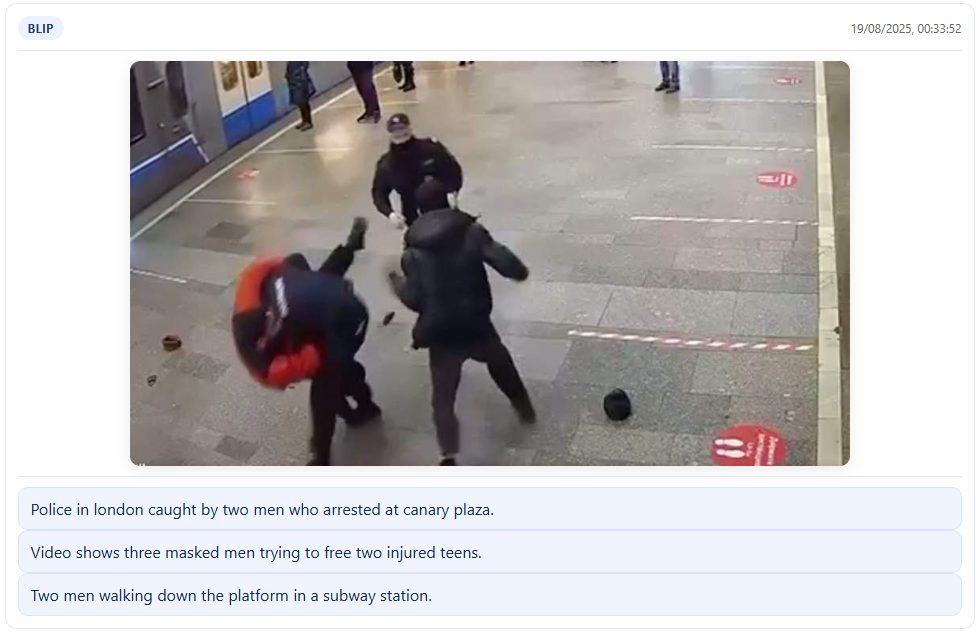

# Multimodal Captioning System

This project implements a multimodal pipeline for image → text captioning with three alternative approaches:

#### ViT-GPT2 (Hugging Face)

- Ready-to-use VisionEncoderDecoder model (nlpconnect/vit-gpt2-image-captioning) directly from Hugging Face.
- Combines ViT encoder and GPT2 decoder in a single pretrained model.
- Produces 2–3 captions per image with controlled sampling.

#### BLIP (baseline)

   - Local BLIP model (Salesforce/blip-image-captioning-base).
   - Pretrained multimodal model that generates captions directly.
   - Used for comparison against ViT-GPT2.

#### LLaVA (Large Language and Vision Assistant)

- Hugging Face model (llava-hf/llava-1.5-7b-hf).
- Multimodal LLM with strong reasoning ability over images.
- Provides advanced, conversational-level captions.

## Important note:
In app/Dockerfile the LLaVA block is commented out by default.
If you want to pre-download and cache LLaVA during build, you must uncomment it. Otherwise the model will try to load at runtime and you will constantly hit errors.

# Usage

## CLI (single container)

Run pipelines without the UI. Mount your local folder with images into /app/data (change `$(pwd)/test_examples` or use them):
```
docker build -t caption-app ./app

docker run --gpus '"device=0"' -it --rm \
    -v $(pwd)/test_examples:/app/data \
    -v $(pwd)/results:/app/results \
    caption-app bash

python3 caption.py --input /app/data --model blip vitgpt2 --output results/output.json
```
or on Win
```
docker run -it --rm `
    -v ${PWD}/test_examples:/app/data `
    -v ${PWD}/results:/app/results `
    caption-app bash
```

Options:

- `--input` path to image or folder inside the container
- `--model` choose a model or a list of model to compare them
- `--output` define the out file

Also you can tune params for the models in `config.py`: 
`NUM_CAPTIONS = 3 MAX_TOKENS = 30 TEMPERATURE = 0.9`

## Web UI (docker-compose)



Run the full application (FastAPI backend + Nginx frontend + UI):
```
docker-compose up --build
```

UI available at: http://localhost

Uploaded images and history are stored in ./results/